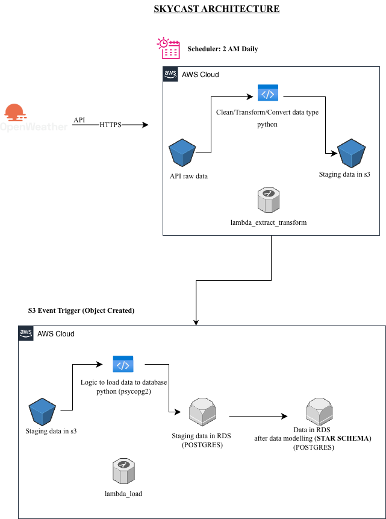

# 🌤️ **SkyCast Weather Data Pipeline**

## **Overview**

SkyCast is a serverless, event-driven **Data Engineering pipeline** built on AWS that automates the process of fetching,
transforming, and loading weather data into a PostgreSQL RDS database.

The system leverages **AWS Lambda**, **S3**, **EventBridge**, and **RDS** to create a cost-effective and scalable data
flow for weather analytics.

---

## **🔁 Project Architecture**

### **Data Flow Summary**

1. **Extract & Transform Lambda (`lambda_extract_transform`)**
    - Fetches city-wise weather data from **OpenWeather API**.
    - Cleans, optimizes, and converts the data into Parquet format.
    - Stores processed files in **S3 bucket** under `staging/` prefix.
    - Triggered **daily at 2:00 AM** by an **EventBridge Scheduler**.

2. **Load Lambda (`lambda_load`)**
    - Automatically triggered when a **new file lands in the S3 `staging/` folder**.
    - Reads the transformed data and loads it into **PostgreSQL (RDS)** using `psycopg2`.
    - Reads the data from staging table and loads into **PostgreSQL (RDS)** using `psycopg2` **star schema** based tables.
   
---
## **DB Tables**

### Staging
    raw_weather - De-normalised table with raw data 

### Data modelled tables - *STAR SCHEMA*
    | Fact tables      | Dimension Tables                                     |
    |---------------   |------------------------------------------------------|
    | Cloud            | AWS Lambda, S3, RDS, EventBridge                     |
    | Database         | PostgreSQL                                           |
    | Language         | Python 3.13                                          |
    | Packages         | `pandas`, `boto3`, `requests`, `psycopg2`, `pyarrow` |
    | CI/CD            | GitHub Actions                                       |

---

## **🧩 Architecture Diagram**


---

## **⚙️ Project Structure**
```
skycast/
│
├── config/
│ ├── config.json # Area where all config data for the project is maintained!
├── src/
│ ├── ETL/
│ │ ├── extract.py # Extracts data from OpenWeather API
│ │ ├── transform.py # Cleans and optimizes dataset
│ │ ├── stage.py # Uploads data to S3 at various stages
│ │ ├── load.py # Loads transformed data into PostgreSQL
│ │
│ ├── utils/
│ │ ├── db_connect.py # Fetch DB configs from environment variables
│ │ ├── ddl_actions.py # Table creation and maintenance scripts
│ │ ├── data_cleaner.py # Clean data and handle nulls
│ ├── convert_dtype.py # Convert the datatype from source to python compatible
│ ├── s3_ops.py # A util method to handle all aws s3 operations
│
├── config/
│ └── config.json # Contains API keys, S3 paths, DB credentials, etc.
│
├── lambda_extract_transform.py # Lambda for extraction and transformation
├── lambda_load.py # Lambda for loading data to RDS
├── main.py # Local testing and manual pipeline execution
├── requirements.txt # Python dependencies
└── README.md # Project documentation
```
---

## **🚀 AWS Lambda Deployment & Dependencies**

### **Lambda Functions**

#### **1. `lambda_extract_transform`**

- Handles **data extraction and transformation**.
- Fetches data from **OpenWeather API**, cleans it, and stores it as `weather_data_<cdc>.parquet` in **S3/staging/**.
- Triggered by an **AWS EventBridge Scheduler** every day at **2:00 AM**.

#### **2. `lambda_load`**

- Automatically triggered when a new file is uploaded to the **S3 `staging/` folder** of the `skycast-weather-report`
  bucket.
- Loads data into **PostgreSQL RDS** using `psycopg2`.
- Ensures schema consistency and handles incremental inserts.

---

### **Python Runtime & Layers**

- **Python Version:** `3.13`
- **Shared Layer:** Common dependencies like `pandas`, `boto3`, `pyarrow`.
- **Custom Layer:**
    - Contains **`psycopg2`** compiled on **Amazon Linux 2023 AMI EC2**.
    - Attached to the `lambda_load` function using its **ARN reference**.

---

### **CI/CD Workflow (GitHub Actions)**

- Pushing to the *main* branch triggers **two GitHub Actions:**
    1. **Build & Package:**  
       Zips Lambda code with dependencies.
    2. **Deploy:**  
       Uploads packages to AWS Lambda (`extract_transform` and `load`) automatically.

---

## **🔐 Environment Variables**

| Variable Name | Description                         |
|---------------|-------------------------------------|
| `DB_HOST`     | PostgreSQL host endpoint            |
| `DB_PORT`     | Database port number (default 5432) |
| `DB_NAME`     | Database name                       |
| `DB_USER`     | Username for RDS                    |
| `DB_PASSWORD` | Password for RDS                    |
| `OPENWEATHER_API_KEY`     | OpenWeather API key                 |


---

## **🧠 Key Features**

- **Serverless Architecture:** Fully managed AWS resources — no servers to maintain.
- **Event-Driven Triggers:** EventBridge for scheduling, S3 event for load automation.
- **Data Optimization:** Transformed data stored in efficient Parquet format.
- **Scalable Design:** Each stage is decoupled and independently triggerable.
- **Automated CI/CD:** Seamless Lambda updates through GitHub Actions.

---

## **🧰 Technologies Used**

| Category      | Tools/Services                                       |
|---------------|------------------------------------------------------|
| Cloud         | AWS Lambda, S3, RDS, EventBridge                     |
| Database      | PostgreSQL                                           |
| Language      | Python 3.13                                          |
| Packages      | `pandas`, `boto3`, `requests`, `psycopg2`, `pyarrow` |
| CI/CD         | GitHub Actions                                       |

---

## **📆 Future Enhancements**

- Add CloudWatch metrics dashboard for pipeline performance.
- Include S3 object versioning for data recovery.
- Integrate AWS Glue for schema cataloging.
- Extend API coverage for multiple weather parameters.

---
## TABLE SCHEMA - For reference

```
create table dim_location(
	location_id serial not null primary key,
	latitude double precision,
	longitude double precision,
	country varchar(3),
	sunrise timestamp with time zone,
	sunset timestamp with time zone,
	city varchar(163)
)

create table dim_weather(
	weather_dim_id serial primary key not null,
	description text,
	main text
)

create table fact_weather(
	fact_weather_id serial primary key,
	weather_dim_id int not null,
	location_id int not null,
	feels_like double precision,
	ground_level bigint,
	humidity bigint,
	pressure bigint,
	sea_level bigint,
	temperature double precision,
	max_temperature double precision,
	min_temperature double precision,
	one_hour_rain double precision,
	wind_speed double precision,
	wind_degree bigint,
	wind_gust double precision,
	clouds bigint,
	visibility bigint,
	fetched_at timestamp without time zone,
	data_time timestamp without time zone,
	foreign key(time_id) references dim_time(time_id),
	foreign key(location_id) references dim_location(location_id),
	foreign key(weather_dim_id) references dim_weather(weather_dim_id)
);

COMMENT ON COLUMN fact_weather.clouds IS 'unit in percentage';
COMMENT ON COLUMN fact_weather.visibility IS 'Visibility, meter. The maximum value of the visibility is 10 km';
COMMENT ON COLUMN fact_weather.one_hour_rain IS 'Precipitation, mm/h';

```

---

## **👨‍💻 Author**

**Mohammed Kawuser**  
*Data Engineer | Former Front-End Developer | Python | AWS & Cloud Data Pipelines*

