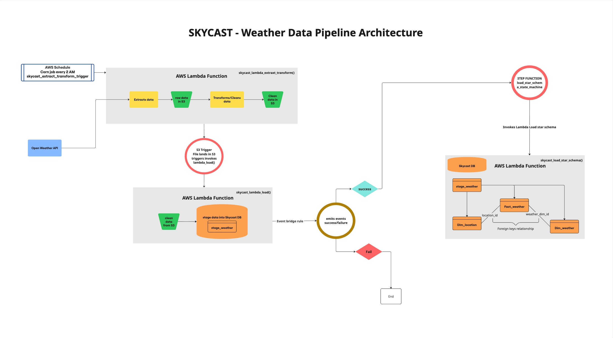

# **SkyCast – Serverless Weather Automation Pipeline**

## **Overview**

SkyCast is a serverless, event-driven **DevOps automation pipeline** built on AWS.  
It orchestrates the complete workflow of fetching, transforming, and loading weather data into a PostgreSQL RDS instance using **cloud-native services**, **CI/CD**, and **event-driven triggers**.

The system leverages **AWS Lambda**, **S3**, **EventBridge**, **Step Functions**, and **GitHub Actions** to deliver a scalable, low-maintenance, fully automated cloud workflow.

---

## **🔁 Project Architecture**

### **Data Flow Summary**

1. **Extract & Transform Lambda (`lambda_extract_transform`)**
   - Fetches city-wise weather data via the **OpenWeather API**.
   - Cleans, normalizes, and converts raw responses to **Parquet**.
   - Stores processed output in **S3** under the `staging/` prefix.
   - Triggered automatically using **EventBridge Scheduler** at **2:00 AM**.

2. **Load Lambda (`lambda_load`)**
   - Triggered by **S3 ObjectCreated** events.
   - Loads the Parquet file into **PostgreSQL RDS** using a custom `psycopg2` Lambda Layer.
   - Performs schema validation and incremental ingestion.

3. **Star Schema Loader (`lambda_load_star_schema`)**
   - Triggered via **AWS Step Functions** after a successful load.
   - Executes an RDS stored procedure to populate:
     - **fact_weather**
     - **dim_location**
     - **dim_weather**
   - Updates CDC tracking and ensures end-to-end data consistency.

---

## **DB Tables**

### **Staging**
raw_weather - raw denormalized ingestion table

### **Data Modelled Tables – *STAR SCHEMA***
fact_weather - quantitative metrics for analytics

#### **Fact Tables**
dim_location
dim_weather - descriptive attributes extracted from raw data

---

## **Architecture Diagram**

---

## **Project Structure**
- 
skycast/
│
├── config/
│ └── config.json # Centralized configuration
│
├── src/
│ ├── ETL/
│ │ ├── extract.py # Weather API extraction logic
│ │ ├── transform.py # Data transformation layer
│ │ ├── stage.py # Uploads processed files to S3
│ │ ├── load.py # Loads data into RDS staging
│ │
│ ├── utils/
│ │ ├── db_connect.py # RDS connection handler
│ │ ├── ddl_actions.py # Schema setup & table creation
│ │ ├── data_cleaner.py # Data cleanup utilities
│ ├── convert_dtype.py # Datatype conversion helpers
│ ├── s3_ops.py # S3 utility functions
│
├── lambda_extract_transform.py # Lambda: extract + transform
├── lambda_load.py # Lambda: load → PostgreSQL RDS
├── lambda_star_schema_load.py # Lambda: star schema loader
├── main.py # Local manual execution
├── requirements.txt # Python dependencies
└── README.md

-
---

## **AWS Lambda Deployment & Dependencies**

### **Lambda Functions**

#### **1. `lambda_extract_transform`**
- Extracts + transforms API data  
- Outputs `weather_data_<cdc>.parquet` to `S3/staging/`  
- Triggered via **EventBridge Scheduler**  

#### **2. `lambda_load`**
- Activated by **S3 event**  
- Loads processed data into **RDS** using custom `psycopg2` layer  
- Handles incremental inserts & schema alignment  

#### **3. `lambda_load_star_schema`**
- Triggered via **Step Functions**  
- Executes stored procedure to update fact/dim tables  
- Maintains CDC + relational integrity  

---

### **Python Runtime & Layers**

- **Python Version:** `3.13`
- **Shared Layer:** `pandas`, `boto3`, `pyarrow`
- **Custom Layer:**
  - Compiled `psycopg2` for **Amazon Linux 2023**
  - Attached to `lambda_load` via Layer ARN  

---

### **CI/CD Workflow (GitHub Actions)**

Two GitHub Actions are executed on every `main` branch push:

1. **Build & Package**
   - Installs dependencies  
   - Bundles Lambda source  
   - Packages and uploads Lambda layers  

2. **Deploy**
   - Automatically deploys all Lambda functions:
     - `lambda_extract_transform`
     - `lambda_load`
     - `lambda_load_star_schema`
   - Enables zero-manual updates across environments

---

## **Environment Variables**

| Variable Name          | Description                         |
|------------------------|-------------------------------------|
| `DB_HOST`              | PostgreSQL host endpoint            |
| `DB_PORT`              | Default 5432                        |
| `DB_NAME`              | Database name                       |
| `DB_USER`              | RDS username                        |
| `DB_PASSWORD`          | RDS password                        |
| `OPENWEATHER_API_KEY`  | Weather API authentication key      |

---

## **Key DevOps Features**

- **Event-Driven Architecture** using S3, EventBridge, and Step Functions  
- **Zero-server operations** powered by AWS Lambda  
- **CI/CD automation** via GitHub Actions  
- **Modular Lambda Layers** for clean dependency management  
- **Scalable and decoupled workflow** for each processing stage  
- **Optimized Storage** using Parquet for performance + low cost  

---

## **Technologies Used**

| Category      | Tools/Services                                       |
|---------------|------------------------------------------------------|
| Cloud         | AWS Lambda, S3, RDS, EventBridge, Step Functions     |
| Infrastructure| IAM, Lambda Layers, Event-Driven Automation          |
| Database      | PostgreSQL                                           |
| Language      | Python 3.13                                          |
| Packages      | `pandas`, `boto3`, `requests`, `psycopg2`, `pyarrow` |
| CI/CD         | GitHub Actions                                       |

---

## **Future Enhancements**

- CloudWatch dashboards & alarms for observability  
- S3 versioning & lifecycle policies  
- Integration with AWS Glue Data Catalog  
- SNS notifications for pipeline status/failures  
- Terraform IaC for end-to-end infra provisioning  

---

## **uthor**

**Mohammed Kawuser**  
*Cloud & DevOps Engineer | Python | PostgreSQL | AWS | Serverless Architectures | CI/CD Automation*
